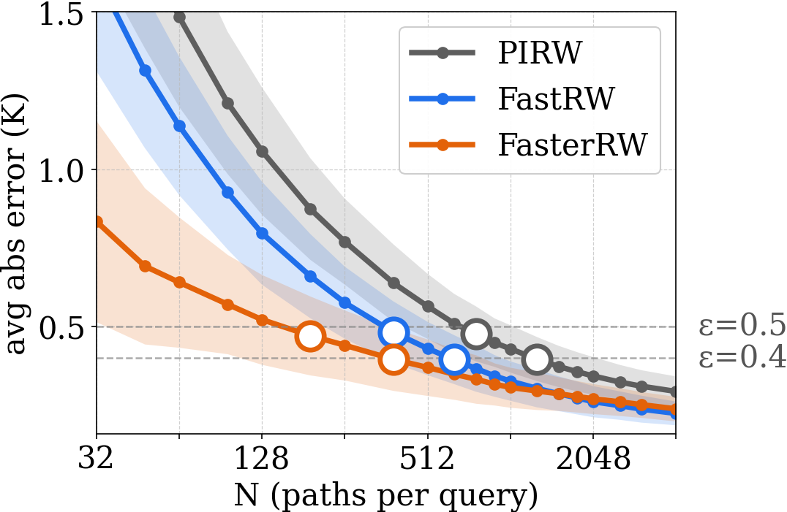

# FastRW（中文）

[English README](README.md)

基于 Apple Metal + C++17 的 GPU 随机游走热模拟求解器，包含 **FastRW /
FasterRW** 算法的复现实验框架。

[](docs/figures/bootstrap_case1.png)

`FastRW`（算法 1 + 2）结合 FEM 先验与残差随机游走，通过路径尾段复用做
逆方差融合。`FasterRW`（算法 1 + 2 + 3）在此基础上加入先验误差坐标下的
通用克里金高斯过程精修。本仓库可基于预计算的 COMSOL 先验 + 一键脚本，
完整复现 TCAD 论文中的所有表格与图。

---

## 目录

- [快速开始](#快速开始)
- [仓库结构](#仓库结构)
- [复现流程](#复现流程)
- [分阶段手动调用](#分阶段手动调用)
- [配置说明](#配置说明)
- [算法概览](#算法概览)
- [硬件与平台说明](#硬件与平台说明)
- [引用](#引用)
- [许可证](#许可证)

---

## 快速开始

完整复现（Table 1 + Tables tab:{multi,tradeoff,weakprior,time} +
Fig. bootstrap + HTML 报告）在 Apple M 系列上使用随附 Phase-1 长 MC
artifacts 时**约 1 分钟**；如从头跑 Phase 1 约 **12 分钟**。

```bash
# 1. 克隆仓库 + 创建 conda 环境（环境名: fastrw）
git clone https://github.com/<your-org>/ResRW.git
cd ResRW
conda env create -f environment.yml
conda activate fastrw

# 2. 下载 artifact 压缩包（193 MB 解压后，58 MB 压缩包）
#    Google Drive 链接（上传后请替换）：
#
#        https://drive.google.com/<TODO_REPLACE_WITH_REAL_LINK>
#
#    保存为仓库根目录下的 ./resrw-artifacts-v1.zip

# 3. 原地解压（自动填充 data/ 与 outputs/tcad_table1/）
./scripts/fetch_artifacts.sh

# 4. 一键复现
./reproduce.sh
```

复现完成后在浏览器中打开 `outputs/report.html` —— 这是一个自包含的
HTML 文件，所有表格已渲染、所有 bootstrap 图已 base64 内嵌。

> Artifact 压缩包**未**保存在 git 中（体积太大）。如果不下载，
> `./reproduce.sh` 会自动回退到 Phase 1（Metal MC，M 系列约 10 分钟），
> 从零生成同样的产物。

---

## 仓库结构

```
ResRW/
├── README.md, README.zh.md, LICENSE, CMakeLists.txt, environment.yml, .gitignore
├── reproduce.sh                  一键 Phase 1 -> 2 -> 3 -> 4 驱动脚本
│
├── src/                          C++17 随机游走核心
│   ├── main.cpp, main_metal.cpp  CPU 与 Metal 入口
│   ├── walker.cpp, walker_metal.mm
│   ├── geometry.cpp, simulation_config.cpp
├── include/                      头文件
├── third_party/nlohmann/         vendored JSON
│
├── scripts/                      已整理的一键流程脚本与辅助工具
│   ├── build_and_run_metal.sh    GPU MC 执行器（由 run_*_direct.sh 调用）
│   ├── build_and_run.sh          CPU 备选（Linux 可用，便携）
│   ├── run_pirw_direct.sh        Phase 1: PIRW 蒙特卡洛（N_max=4096）
│   ├── run_fastrw_direct.sh      Phase 1: FastRW 蒙特卡洛（N_max=8192）
│   ├── run_pirw_post.{sh,js}     Phase 2: PIRW bootstrap（论文锁定 N）
│   ├── run_fastrw_post.{sh,js}   Phase 2: FastRW bootstrap（算法 1+2）
│   ├── run_fasterrw_post.{sh,js} Phase 2: FasterRW bootstrap（算法 1+2+3）
│   ├── run_bootstrap_sweep.{sh,js}  Phase 3: 密集 N 扫 + Fig. bootstrap
│   ├── plot_bootstrap_curves.py     Phase 3: bootstrap_case{1,2,3}.{png,pdf}
│   ├── run_group_size_sweep.{sh,js} Phase 3: tab:multi
│   ├── run_prior_dof_sweep.{sh,js}  Phase 3: tab:tradeoff
│   ├── run_weak_prior.{sh,js}       Phase 3: tab:weakprior
│   ├── run_wallclock_breakdown.{sh,js} Phase 3: tab:time
│   ├── build_table1_bootstrap.js    Phase 3: 从 sweep 生成 Markdown Table 1
│   ├── build_html_report.py         Phase 4: 自包含的 outputs/report.html
│   ├── fetch_artifacts.sh           原地解压 artifact 压缩包
│   └── _lib.js                      共享 JS 工具函数
│
├── configs/
│   ├── tcad_table1/                 三个 case 的标准配置（Phase 1、2）
│   │   ├── pirw_case{1,2,3}.json    PIRW（无尾段修正）
│   │   └── fastrw_case{1,2,3}.json  FastRW（开启尾段修正）
│   ├── tcad_table_tradeoff/         tab:tradeoff 三种 DoF 配置
│   └── tcad_table_weakprior/        tab:weakprior 弱先验配置
│
├── docs/figures/                    入库的 Fig. bootstrap PNG
├── data/                            gitignored；由 fetch_artifacts.sh 填充
├── outputs/                         gitignored；由 fetch_artifacts.sh + reproduce.sh 填充
└── legacy/                          不再维护；诊断脚本 + COMSOL 重建工具
```

实验种子全程固定为 **42**。所有现行配置均使用
`walker.delta_x = 5e-7`、`boundary.rho = 1.56`，因此
`boundary.epsilon.{neumann,robin} = 7.8e-7`。

---

## 复现流程

```
                     fetch_artifacts.sh
                            |
                            v
            +---------------+---------------+
            |   data/cases/case{1,2,3}/      |
            |   outputs/tcad_table1/...      |  (随包发布)
            +---------------+---------------+
                            |
                            v
             reproduce.sh   (检测到 MC 已就绪则自动跳过 Phase 1)
                            |
        ===================== Phase 1 =====================
                            |  (如已就绪则跳过)
            run_pirw_direct.sh    --> outputs/tcad_table1/pirw_case{1,2,3}/
            run_fastrw_direct.sh  --> outputs/tcad_table1/fastrw_case{1,2,3}/
                            |
        ===================== Phase 2 =====================
                            |
            run_pirw_post.sh      \
            run_fastrw_post.sh     >  outputs/tcad_table1/paper_results/
            run_fasterrw_post.sh  /          case*_*_eps{0.4,0.5}.json
                            |
        ===================== Phase 3 =====================
                            |
            run_bootstrap_sweep.sh         bootstrap_sweep_*.json + Fig. bootstrap
            run_group_size_sweep.sh        case1_group_sweep.json     (tab:multi)
            run_prior_dof_sweep.sh         case1_dof_sweep.json       (tab:tradeoff)
              --skip-fem --skip-mc          (使用随包发布的 Phase-3 MC + 计时文件)
            run_weak_prior.sh              case1_weakprior_summary.json (tab:weakprior)
              --skip-mc                     (使用随包发布的 Λ=1e-3 MC)
            run_wallclock_breakdown.sh     case1_eps04_wallclock.json (tab:time)
                            |
        ===================== Phase 4 =====================
                            |
            build_html_report.py  --> outputs/report.html
```

`reproduce.sh` 命令行参数：

| 参数 | 作用 |
| ---- | ---- |
| `--cases=1,2,3` | 限定 case 子集（仅作用于 Phase 1 + 2）。 |
| `--force-phase1` | 即使已有 MC 产物也强制重跑 Phase 1。 |
| `--skip-phase3` | 跳过四个子实验和 bootstrap 扫频图。 |
| `--skip-report` | 跳过最后的 `outputs/report.html` 构建。 |

---

## 分阶段手动调用

每个辅助脚本都支持 `--help`（或 `-h`）查看完整契约。常用配方如下。

### Phase 1 —— Metal 蒙特卡洛

```bash
./scripts/run_pirw_direct.sh        # 三个 case，N=4096 条路径
./scripts/run_pirw_direct.sh 2      # 只跑 case 2
./scripts/run_fastrw_direct.sh      # 三个 case，N=8192 条路径
```

每个 case 输出 `direct.csv`、`constraints.json`（被后处理消费的逐路径
状态流）、`summary.json` 以及 `last_*.log`。

### Phase 2 —— 论文锁定 N 的 bootstrap

```bash
./scripts/run_pirw_post.sh          # 所有 case 和 eps
./scripts/run_fastrw_post.sh        # 算法 1+2
./scripts/run_fasterrw_post.sh      # 算法 1+2+3
```

每个 `(case, method, eps)` 单元用 **B=500** 次 bootstrap 评估，结果存于
`outputs/tcad_table1/paper_results/case{1,2,3}_{pirw,fastrw,fasterrw}_eps{0.4,0.5}.json`。

### Phase 3 —— 子实验

```bash
./scripts/run_bootstrap_sweep.sh                 # 密集 N 扫频 + Fig. bootstrap
./scripts/run_group_size_sweep.sh                # tab:multi  (Case 1)
./scripts/run_prior_dof_sweep.sh --skip-fem --skip-mc   # tab:tradeoff (无需 COMSOL)
./scripts/run_weak_prior.sh --skip-mc            # tab:weakprior
./scripts/run_wallclock_breakdown.sh             # tab:time
```

### Phase 4 —— HTML 报告

```bash
python3 scripts/build_html_report.py
open outputs/report.html
```

---

## 配置说明

`configs/` 下所有配置共享同一 schema。温度输入按用途拆分：

```json
{
  "data": {
    "power_density_path":        "../../data/cases/<case>/power.bin",
    "prior_temperature_path":    "../../data/cases/<case>/comsol/comso_<dof>/temp.bin",
    "reference_temperature_path":"../../data/cases/<case>/comsol/comso_full/temp.bin",
    "temperature_offset": 0
  }
}
```

- `prior_temperature_path`：FastRW 尾段修正使用的 FEM 先验温度场；
  PIRW 配置中 `walker.use_tail_correction: false`，会忽略该字段。
- `reference_temperature_path`：仅用于报告误差的金标准
  （在 `direct.csv` 中作为 `GT_Temperature` 列）。
- `walker.delta_x`、`boundary.rho`、`boundary.epsilon.*` 在论文中已锁定，
  复现时不要修改。

`run.seed = 42` 全局一致。给定相同 seed、相同 threadgroup 数、相同二进制，
Metal kernel 输出可复现。

### 温度单位

`data/cases/*/comsol/*/` 和 `rule_of_thumb/` 下的 `temp.bin` **以摄氏度
存储**。C++ kernel 内部已处理环境温度扣减；配置中的 `temperature_offset`
是在游走结束后叠加的开尔文偏移。

---

## 算法概览

Robin 边界热传导 PDE 用三层几何（底/热源/顶）中的 Itô 扩散求解，终止条件
包括：
- 顶/底 Robin 反射（参数 `h`）；
- 侧壁 Neumann 反射；
- 热源面 Dirichlet 吸收（通过尾段修正实现）。

#### PIRW（基线）

对每个查询点，独立采样 `N` 条随机游走；每条游走的 Robin 终值贡献 +
热源沿路径的局部时间积分构成一次无偏温度估计。直接取算术平均作为
结果。

#### FastRW = 算法 1 + 2（本仓库）

- **算法 1（路径尾段截断, Λ）：** 当一条游走的剩余权重低于 `Λ` 时，
  截断尾段并直接使用截断点处的先验温度。引入的偏差不超过
  `Λ · max_prior_error`。
- **算法 2（无自融合的逆方差融合）：** 每条游走的完整观测和它的
  截断-先验复用观测视为两个相关测量值；用同一查询点上其它游走的
  leave-one-out 协方差进行融合。对应
  `bootstrap_sweep_fastrw.json::fastrw_avg_abs_*` 系列。

#### FasterRW = 算法 1 + 2 + 3

- **算法 3（通用克里金 GP 残差）：** 对每个查询点，将 FastRW 残差
  （FastRW 估计 − 先验）对 M-1 个其它查询点的残差做通用克里金回归
  （Matern-3/2 核，幅值用 `amp_factor` 放大）。克里金预测替换原始
  FastRW 值。对应 `fasterrw_avg_abs_*` 系列。

数学推导见论文；各脚本的头部注释（例如
`scripts/run_bootstrap_sweep.sh`）说明了所用度量的具体定义。

---

## 硬件与平台说明

- **推荐：** Apple Silicon Mac（M1 或更高）。Metal kernel 在
  **Apple M5 Pro** 上开发和基准测试。
- **Linux / 非 Apple：** `scripts/build_and_run.sh` 可在任何支持
  C++17 + threads 的 POSIX 平台上构建 CPU 版 `random_walker`，但
  速度比 Metal 慢约 **30–60 倍**。CPU 目标不再针对论文锁定配置维护，
  仅适用于开发期烟雾测试。
- **Node.js：** 所有后处理用纯 stdlib Node（`>= 18`）。**无需** 运行
  `npm install`。
- **Python：** 仅依赖 `numpy` 与 `matplotlib`（已写入
  `environment.yml`）。
- **COMSOL：** 开源流程**无需 COMSOL 授权**。artifact 压缩包中已包含
  流程消费的所有先验温度场。重建 COMSOL 先验的脚本
  （`legacy/scripts/run_comsol_*.sh`）保留在 `legacy/` 仅供查阅。

### Bit-level 可复现性注意事项

- Metal kernel 在给定 GPU + Metal 二进制下是确定性的，但不同 GPU
  之间可能存在几个 ULP 的差异。
- 后处理完全确定（纯 Node，无浮点原子操作）。
- Bootstrap 种子由 `(seed_base, B, trial)` 决定性派生。

---

## Artifact 压缩包内容

`resrw-artifacts-v1.zip`（约 58 MB 压缩、193 MB 解压、共 236 个文件）
包含：

| 路径 | 用途 |
| ---- | ---- |
| `data/cases/case{1,2,3}/power.bin` | 功率密度输入。 |
| `data/cases/case{1,2,3}/metadata.json` | case 元数据。 |
| `data/cases/case{1,2,3}/comsol/comso_*/temp.bin` | FEM 先验温度（摄氏度）。 |
| `data/cases/case{1,2,3}/comsol/comso_*/metadata.json` | DoF、COMSOL 求解时间。 |
| `data/cases/case1_power6/comsol/comso_{699,1288,10254}/timing_warm.json` | FEM 热网格计时（用于 tab:tradeoff / tab:time）。 |
| `data/cases/case1_power6/rule_of_thumb/` | tab:weakprior 用的均匀先验。 |
| `outputs/tcad_table1/{fastrw,pirw}_case{1,2,3}/direct.csv,constraints.json,...` | Phase-1 长 MC 产物（PIRW N_max = 4096，FastRW N_max = 8192）。 |
| `outputs/tcad_table_tradeoff/dof{699,1288,10254}/` | tab:tradeoff 的 Phase-3 MC。 |
| `outputs/tcad_table_weakprior/fastrw_case1_rot/` | tab:weakprior 的 Phase-3 MC（Λ=1e-3 弱先验）。 |

**不**入包：COMSOL `.mph` 工程文件、`temp.bin` 的 CSV 副本、COMSOL
workspace 配置、以及 case 4 / 5 数据（开源复现流程未使用）。

---

## 引用

如使用本代码或 FastRW / FasterRW 算法，请引用：

```bibtex
@article{wang_fastrw_2026,
  title   = {FastRW: ...},
  author  = {Wang, Zixiao and ...},
  journal = {IEEE Transactions on Computer-Aided Design},
  year    = {2026},
  note    = {To appear}
}
```

（待补：发表期刊详情、DOI、precalculation-PIRW 引用。）

---

## 许可证

MIT — 详见 [LICENSE](LICENSE)。
